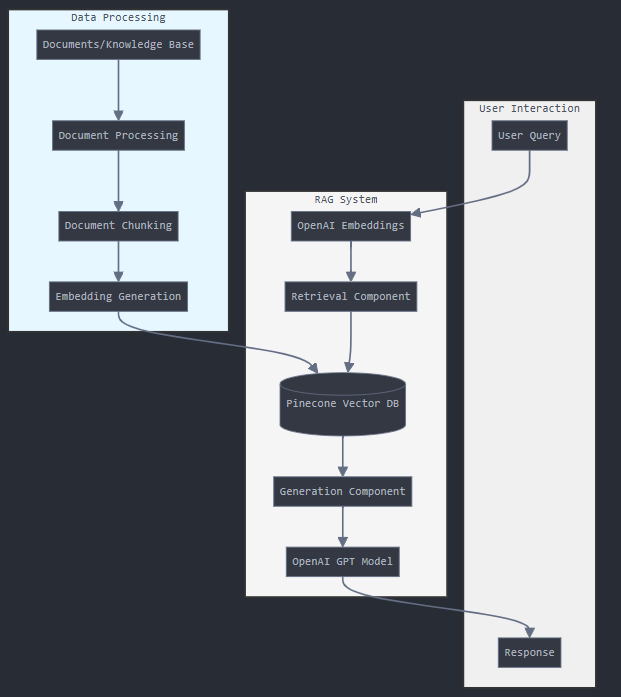

# RAG with OpenAI and Pinecone - Implementation Guide

## Project Overview

This repository contains a Retrieval-Augmented Generation (RAG) system built using OpenAI's models and the LangChain framework, with Pinecone as the vector database. RAG systems enhance large language model outputs by retrieving relevant information from a knowledge base before generating responses, resulting in more accurate and contextually appropriate answers.

## Architecture



The RAG system consists of several key components:

1. **Document Processing Pipeline**:
   - Document loading and parsing
   - Text chunking for optimal embedding
   - Embedding generation using OpenAI's embedding models

2. **Vector Database (Pinecone)**:
   - Storage of document embeddings
   - Fast similarity search capabilities
   - Scalable vector storage

3. **Retrieval System**:
   - Query embedding generation
   - Similarity search in the vector database
   - Context retrieval based on relevance

4. **Generation System**:
   - Integration of retrieved context with the original query
   - Response generation using OpenAI's language models
   - Answer formatting and presentation

## Prerequisites

- Python 3.8+
- OpenAI API key
- Pinecone API key
- LangChain library

## Installation

1. Clone the repository:
   ```bash
   git clone https://github.com/Samuelfdm/AREP_TALLER9_LLM_RAG.git
   cd AREP_TALLER9_LLM_RAG
   ```

2. Create and activate a virtual environment:
   ```bash
   python -m venv venv
   source venv/bin/activate  # On Windows: venv\Scripts\activate
   ```

3. Install the required packages:
   ```bash
   pip install -r requirements.txt
   ```

4. Set up environment variables:
   ```bash
   export OPENAI_API_KEY="your-openai-api-key"
   export PINECONE_API_KEY="your-pinecone-api-key"
   export PINECONE_ENVIRONMENT="your-pinecone-environment"
   ```
   On Windows, use `set` instead of `export`.

## Project Structure

```
rag-openai-pinecone/
├── data/                      # Sample documents for the knowledge base
├── notebooks/                 # Jupyter notebooks for exploration
├── src/
│   ├── document_processor.py  # Document loading and processing
│   ├── embeddings.py          # Embedding generation using OpenAI
│   ├── pinecone_utils.py      # Pinecone vector database utilities
│   ├── rag_pipeline.py        # Main RAG implementation
│   └── utils.py               # Utility functions
├── .env.example               # Example environment variables
├── main.py                    # Entry point for the application
├── requirements.txt           # Project dependencies
└── README.md                  # This file
```

## Usage

### 1. Prepare Your Documents

Place your knowledge base documents in the `data/` directory.

### 2. Process Documents and Create Embeddings

```python
from src.document_processor import process_documents
from src.embeddings import create_embeddings
from src.pinecone_utils import initialize_pinecone, store_embeddings

# Process documents into chunks
documents = process_documents("data/")

# Create embeddings
document_embeddings = create_embeddings(documents)

# Initialize Pinecone
index = initialize_pinecone("my-index")

# Store embeddings in Pinecone
store_embeddings(index, document_embeddings, documents)
```

### 3. Run RAG Queries

```python
from src.rag_pipeline import RAGPipeline

# Initialize the RAG pipeline
rag = RAGPipeline()

# Run a query
response = rag.query("What is the capital of France?")
print(response)
```

## Implementation Details

### Document Processing

We use LangChain's document loaders to support various file formats (PDF, TXT, DOCX, etc.). Documents are then split into smaller chunks using a text splitter to optimize for embedding and retrieval.

```python
from langchain.document_loaders import DirectoryLoader
from langchain.text_splitter import RecursiveCharacterTextSplitter

# Load documents
loader = DirectoryLoader('./data/', glob="**/*.pdf")
documents = loader.load()

# Split documents into chunks
text_splitter = RecursiveCharacterTextSplitter(
    chunk_size=1000,
    chunk_overlap=200
)
document_chunks = text_splitter.split_documents(documents)
```

### Embedding Generation

OpenAI's embedding models are used to generate vector representations of document chunks.

```python
from langchain.embeddings import OpenAIEmbeddings

# Initialize the embedding model
embeddings = OpenAIEmbeddings()

# Generate embeddings for document chunks
embedded_documents = embeddings.embed_documents([doc.page_content for doc in document_chunks])
```

### Vector Database Setup

Pinecone is used to store and retrieve document embeddings efficiently.

```python
import pinecone
from langchain.vectorstores import Pinecone

# Initialize Pinecone
pinecone.init(api_key=PINECONE_API_KEY, environment=PINECONE_ENV)

# Create index if it doesn't exist
if "my-index" not in pinecone.list_indexes():
    pinecone.create_index("my-index", dimension=1536)  # For OpenAI embeddings

# Create vector store
vectorstore = Pinecone.from_documents(
    document_chunks, 
    embeddings, 
    index_name="my-index"
)
```

### RAG Pipeline

The RAG pipeline combines retrieval and generation to produce enhanced responses.

```python
from langchain.chains import RetrievalQA
from langchain.llms import OpenAI

# Create retriever
retriever = vectorstore.as_retriever(search_kwargs={"k": 3})

# Create LLM
llm = OpenAI(temperature=0)

# Create RAG chain
rag_chain = RetrievalQA.from_chain_type(
    llm=llm,
    chain_type="stuff",
    retriever=retriever
)

# Query the system
response = rag_chain.run("What is the capital of France?")
```

## Example Output

```
Query: What are the benefits of RAG systems?

Response: Retrieval-Augmented Generation (RAG) systems offer several key benefits:

1. Improved accuracy by grounding responses in specific knowledge sources
2. Reduced hallucinations compared to standard LLM outputs
3. Up-to-date information when connected to current knowledge bases
4. Citations and references to source materials
5. Better performance on domain-specific questions
```

## Troubleshooting

### Common Issues

1. **OpenAI API Rate Limits**: If you encounter rate limit errors, implement exponential backoff retry logic.

2. **Pinecone Connection Issues**: Verify your Pinecone API key and environment are correctly set.

3. **Out of Memory Errors**: For large document collections, process them in batches.

## Resources

- [LangChain Documentation](https://python.langchain.com/docs/)
- [OpenAI API Documentation](https://platform.openai.com/docs/introduction)
- [Pinecone Documentation](https://docs.pinecone.io/docs/overview)

## License

This project is licensed under the MIT License - see the LICENSE file for details.
