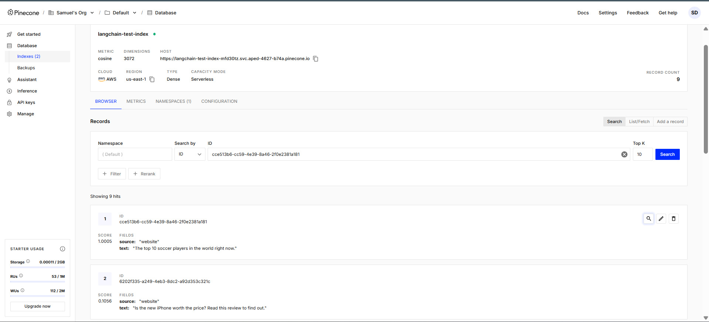

# RAG con OpenAI y Pinecone - Guía de Implementación

## Descripción General del Proyecto

Este repositorio contiene un sistema de Generación Aumentada por Recuperación (RAG) construido utilizando los modelos de OpenAI y el framework LangChain, con Pinecone como base de datos vectorial. Los sistemas RAG mejoran las salidas de los modelos de lenguaje grandes al recuperar información relevante de una base de conocimientos antes de generar respuestas, resultando en respuestas más precisas y contextualmente apropiadas.

## Arquitectura


El sistema RAG consta de varios componentes clave:

1. **Pipeline de Procesamiento de Documentos**:
   - Carga y análisis de documentos
   - División de texto en fragmentos para embeddings óptimos
   - Generación de embeddings utilizando modelos de OpenAI

2. **Base de Datos Vectorial (Pinecone)**:
   - Almacenamiento de embeddings de documentos
   - Capacidades de búsqueda de similitud rápida
   - Almacenamiento vectorial escalable

3. **Sistema de Recuperación**:
   - Generación de embeddings para consultas
   - Búsqueda de similitud en la base de datos vectorial
   - Recuperación de contexto basada en relevancia

4. **Sistema de Generación**:
   - Integración del contexto recuperado con la consulta original
   - Generación de respuestas utilizando modelos de lenguaje de OpenAI
   - Formateo y presentación de respuestas

## Requisitos Previos

- Python 3.8+
- JupyterLab
- OpenAI API key
- Pinecone API key
- LangSmith API key
- LangChain library

## Instalación

### En la carpeta SOLUTION encontrará la versión final del RAG

1. Clone the repository:
   ```bash
   git clone https://github.com/Samuelfdm/AREP_TALLER9_LLM_RAG.git
   cd AREP_TALLER9_LLM_RAG
   cd SOLUTION
   ```

2. Create and activate a virtual environment:
   ```bash
   python -m venv venv
   source venv/bin/activate  # On Windows: venv\Scripts\activate
   ```

3. Install the required packages:
   ```bash
   pip install -r requirements.txt
   ```
- Dependencias:
```
pip install langchain pinecone-client langchain-pinecone langchain-openai bs4
pip install -U langchain-community
%pip install --quiet --upgrade langchain-text-splitters langchain-community langgraph
```

4. Configurar variables de entorno:
   ```bash
   export OPENAI_API_KEY="your-openai-api-key"
   export PINECONE_API_KEY="your-pinecone-api-key"
   export PINECONE_ENVIRONMENT="your-pinecone-environment"
   ```
   En Windows, use `set` en lugar de `export`.
```
os.environ["OPENAI_API_KEY"] = getpass.getpass("Enter API key: ")
os.environ["PINECONE_API_KEY"] = getpass.getpass("Enter API key: ")
os.environ["LANGSMITH_API_KEY"] = getpass.getpass("Enter API key: ")
os.environ["PINECONE_ENVIRONMENT"] = input("Enter API key: ")
```

## Uso

### 2. Procesar Documentos y Crear Embeddings

```python
import os
import getpass
import pinecone
from langchain.document_loaders import WebBaseLoader
from langchain_text_splitters import RecursiveCharacterTextSplitter
from langchain_openai import OpenAIEmbeddings
from langchain_pinecone import PineconeVectorStore
from pinecone import Pinecone, ServerlessSpec

# Configurar claves API
if "OPENAI_API_KEY" not in os.environ:
    os.environ["OPENAI_API_KEY"] = getpass.getpass("Ingrese su clave API de OpenAI: ")

if "PINECONE_API_KEY" not in os.environ:
    os.environ["PINECONE_API_KEY"] = getpass.getpass("Ingrese su clave API de Pinecone: ")

if "PINECONE_ENV" not in os.environ:
    os.environ["PINECONE_ENV"] = input("Ingrese su entorno Pinecone (ej., us-east-1-aws): ")

# Inicializar Pinecone
pc = Pinecone(api_key=os.environ["PINECONE_API_KEY"])
index_name = "langchain-test-index"

# Crear índice si no existe
if index_name not in pc.list_indexes().names():
    pc.create_index(
        name=index_name,
        dimension=3072,  # Dimensión para OpenAI embeddings
        metric="cosine",
        spec=ServerlessSpec(cloud="aws", region=os.environ["PINECONE_ENV"])
    )

# Cargar documentos (ejemplo con carga web)
loader = WebBaseLoader(
    web_paths=("https://en.wikipedia.org/wiki/LangChain",),
    bs_kwargs=dict(
        parse_only=bs4.SoupStrainer(["p", "h1", "h2"])
    ),
)
documents = loader.load()

# Dividir en fragmentos
text_splitter = RecursiveCharacterTextSplitter(chunk_size=1000, chunk_overlap=200)
all_splits = text_splitter.split_documents(documents)

# Generar embeddings
embedding_function = OpenAIEmbeddings()

# Guardar en Pinecone
vector_db = PineconeVectorStore.from_documents(all_splits, embedding_function, index_name=index_name)
```

### 3. Ejecutar Consultas RAG

```python
from langchain.chat_models import ChatOpenAI
from langchain.chains import RetrievalQA

# Crear retriever
retriever = vector_db.as_retriever()

# Inicializar modelo de lenguaje
llm = ChatOpenAI(model_name="gpt-4o-mini")

# Crear pipeline RAG
qa_chain = RetrievalQA.from_chain_type(llm, retriever=retriever, return_source_documents=True)

# Realizar consulta
query = "¿Qué es LangChain y cómo funciona?"
result = qa_chain(query)

# Mostrar respuesta
print("\n===== Respuesta Generada =====")
print(result["result"])

print("\n===== Documentos Fuente =====")
for doc in result["source_documents"]:
    print(f"- {doc.metadata['source']} - {doc.page_content[:200]}...")
```

## Detalles de Implementación

### Procesamiento de Documentos

Utilizamos los cargadores de documentos de LangChain para soportar varios formatos de archivo. Los documentos se dividen en fragmentos más pequeños utilizando un divisor de texto para optimizar el embedding y la recuperación.

```python
import bs4
from langchain.document_loaders import WebBaseLoader
from langchain_text_splitters import RecursiveCharacterTextSplitter

# Cargar documentos desde una URL
loader = WebBaseLoader(
    web_paths=("https://en.wikipedia.org/wiki/LangChain",),
    bs_kwargs=dict(
        parse_only=bs4.SoupStrainer(["p", "h1", "h2"])
    ),
)
documents = loader.load()

# Dividir documentos en fragmentos
text_splitter = RecursiveCharacterTextSplitter(chunk_size=1000, chunk_overlap=200)
document_chunks = text_splitter.split_documents(documents)
```

### Generación de Embeddings

Los modelos de embedding de OpenAI se utilizan para generar representaciones vectoriales de los fragmentos de documentos.

```python
from langchain_openai import OpenAIEmbeddings

# Inicializar el modelo de embedding
embeddings = OpenAIEmbeddings()

# Generar embeddings para fragmentos de documentos
embedded_documents = embeddings.embed_documents([doc.page_content for doc in document_chunks])
```

### Configuración de Base de Datos Vectorial

Pinecone se utiliza para almacenar y recuperar embeddings de documentos de manera eficiente.

```python
from pinecone import Pinecone, ServerlessSpec
from langchain_pinecone import PineconeVectorStore

# Inicializar Pinecone
pc = Pinecone(api_key=os.environ["PINECONE_API_KEY"])
index_name = "langchain-test-index"

# Crear índice si no existe
if index_name not in pc.list_indexes().names():
    pc.create_index(
        name=index_name,
        dimension=3072,
        metric="cosine",
        spec=ServerlessSpec(cloud="aws", region=os.environ["PINECONE_ENV"])
    )

# Crear almacén vectorial
vector_db = PineconeVectorStore.from_documents(
    document_chunks, 
    embeddings, 
    index_name=index_name
)
```

### Pipeline RAG

El pipeline RAG combina recuperación y generación para producir respuestas mejoradas.

```python
from langchain.chat_models import ChatOpenAI
from langchain.chains import RetrievalQA

# Crear retriever
retriever = vector_db.as_retriever()

# Crear LLM
llm = ChatOpenAI(model_name="gpt-4o-mini")

# Crear cadena RAG
rag_chain = RetrievalQA.from_chain_type(
    llm=llm,
    chain_type="stuff",
    retriever=retriever,
    return_source_documents=True
)

# Consultar el sistema
result = rag_chain("¿Qué es LangChain?")
```

## SALIDA DEL PROGRAMA

```
===== Respuesta Generada =====
LangChain es un framework de código abierto diseñado para desarrollar aplicaciones impulsadas por modelos de lenguaje grandes (LLMs). Facilita la creación de aplicaciones que combinan LLMs con otras fuentes de datos y capacidades computacionales. LangChain permite a los desarrolladores construir sistemas que pueden recuperar información contextual para mejorar las respuestas de los LLMs, conectándolos con fuentes externas como bases de datos vectoriales y APIs.

===== Documentos Fuente =====
- https://en.wikipedia.org/wiki/LangChain - LangChain is an open-source framework designed to simplify the creation of applications using large language models (LLMs). It was developed to assist developers in building context-aware...
- https://en.wikipedia.org/wiki/LangChain - The framework is organized into modules that can be used together or independently. These include components for working with language models, manipulating prompt templates, creating chains...
```



## Solución de Problemas

### Problemas Comunes

1. **Límites de Tasa de API de OpenAI**: Si encuentras errores de límite de tasa, implementa una lógica de reintento con retroceso exponencial.

2. **Problemas de Conexión con Pinecone**: Verifica que tu clave API de Pinecone y entorno estén correctamente configurados.

3. **Errores de Memoria Insuficiente**: Para colecciones grandes de documentos, procésalos en lotes.

## Recursos

- [Documentación de LangChain](https://python.langchain.com/docs/)
- [Documentación de API de OpenAI](https://platform.openai.com/docs/introduction)
- [Documentación de Pinecone](https://docs.pinecone.io/docs/overview)

## Licencia

Este proyecto está licenciado bajo la Licencia MIT - ver el archivo LICENSE para más detalles.

## Author

Samuel Felipe Díaz Mamanche